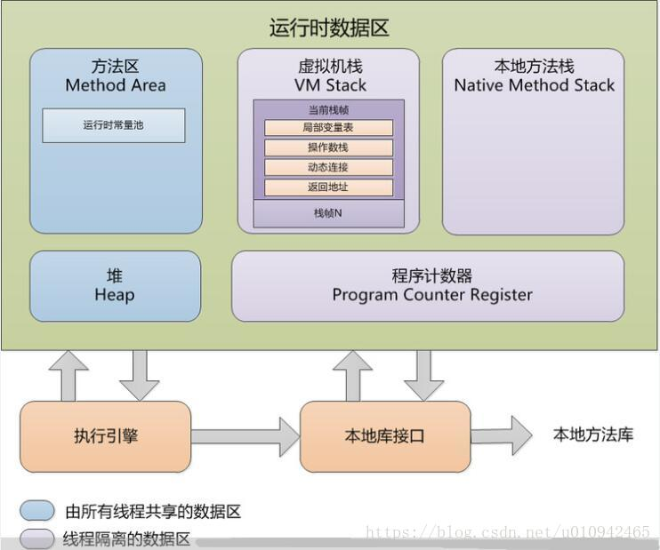
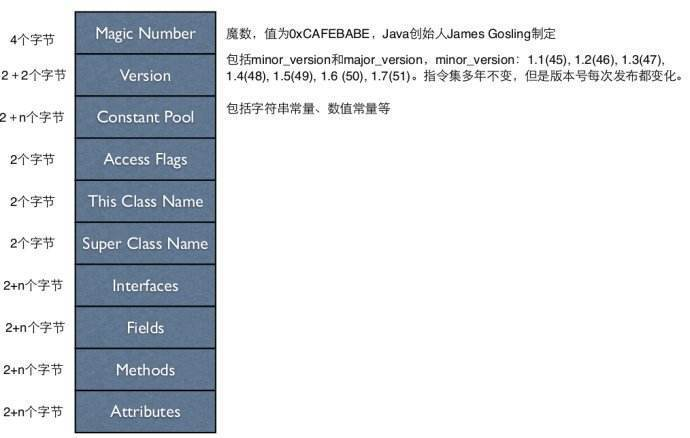
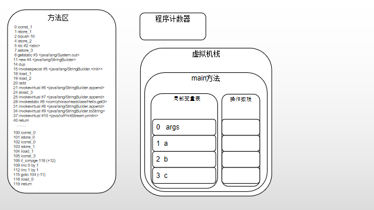
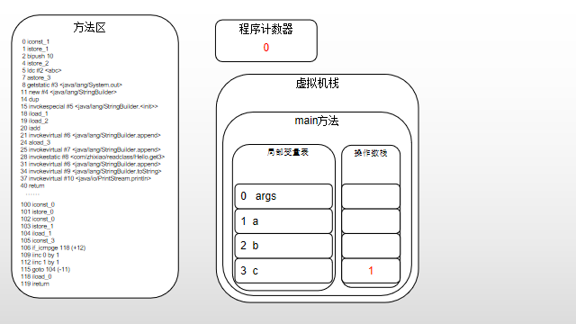
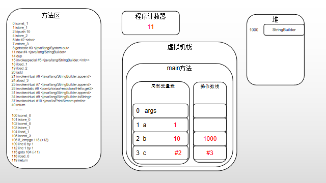
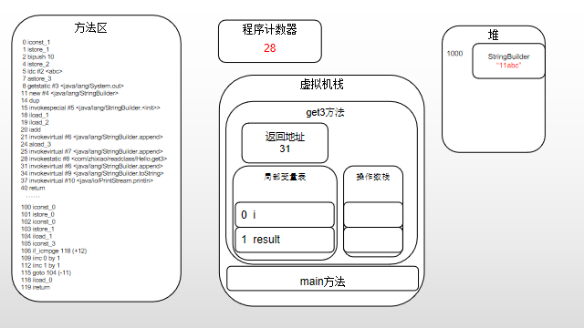
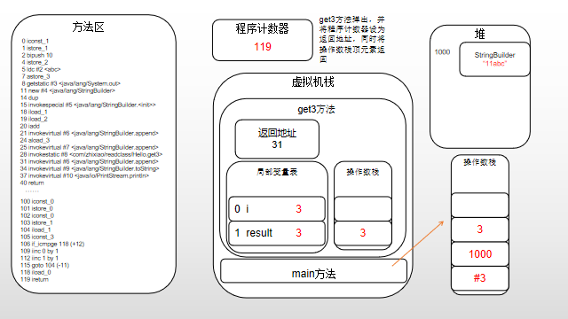
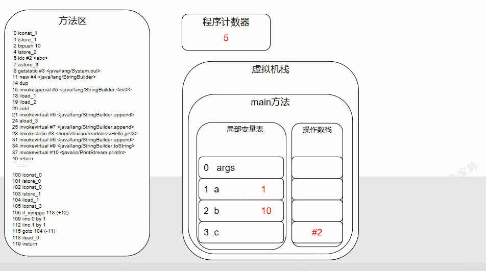

# Android学习笔记 手动执行Java字节码

@[Android, 字节码]

### 背景 
这一次是玩安卓知识星球的第二期作业（分析每一行字节码执行过程中的本地变量数组和操作数栈的状态），完成第一期作业的过程中需要需要操作字节码，但借助Javassist的帮助也没有去学习字节码的相关知识，现在不得不好好的看看Java的字节码究竟是怎样执行的。

### JVM的内存模型
首先复习一下JVM的内存模型 ，JVM的内存模型分为几个区域，如下图：

- 程序计数器：这是线程私有的数据区，用来表示当前执行的是哪一行的指令
- 虚拟机栈：一个栈结构，存储的元素被称为栈帧，每个栈帧包含了一个方法的数据和部分过程结果的区域，同时包含动态连接的信息和方法返回值
	- 局部变量表：用来保存方法局部变量的数组结构
	- 操作数栈：JVM是基于栈结构，操作数栈就是具体用辅助执行指令的栈，栈深度在编译期就写入到class文件中
	- 动态链接：作用是将对方法符号引用转换为直接引用
	- 返回地址：方法执行完成后返回的位置，即调用自己的位置
- 本地方法栈：跟虚拟机栈类似的为本地方法服务的栈结构
- 方法区：线程共享的区域，存储运行时常量池，方法的字节码数据，类的字段等
- 堆：也是线程共享的区域，存储的是Java动态生成的对象数据，垃圾回收器管理的也是这的区域

### class文件
对JVM内存模型有了个简单的回顾，我们继续看看class文件的结构是怎么样的。

1. 魔数和版本号都是对文件本身的描述
2. 常量池：存储的是字面量和符号引用，除了对一些基本类型的操作，像是类名、方法名、常量等都在这里有定义
3. 访问标记：标记class是表示一个类还是一个接口，是否公开，是否是abstract等信息
4. 类索引：引用常量池中的类的全限定类名
5. 父类索引：引用常量池中的父类的全限定类名
6. 接口索引：接口数量和引用常量池中的接口的全限定接口名
7. 字段表集合：定义类所有字段的各种属性
8. 方法：包含每个方法的各种属性，其中就包括上面说到的操作数栈的深度
9. 属性：定义了class文件的属性，比如源代码文件名

### 手动执行字节码指令
接下来结合代码，我们来手动执行字节码指令：
```java
public class Hello {
    public static void main(String[] args) {
        int a = 1;
        int b = 10;
        String c = "abc";
        System.out.println(a + b + c + get3());
    }

    private static int get3() {
        int result = 0;
        for (int i = 0; i < 3; i++) {
            result ++;
        }
        return result;
    }
}

// 生成的字节码指令
// main()
 0 iconst_1
 1 istore_1
 2 bipush 10
 4 istore_2
 5 ldc #2 <abc>
 7 astore_3
 8 getstatic #3 <java/lang/System.out>
11 new #4 <java/lang/StringBuilder>
14 dup
15 invokespecial #5 <java/lang/StringBuilder.<init>>
18 iload_1
19 iload_2
20 iadd
21 invokevirtual #6 <java/lang/StringBuilder.append>
24 aload_3
25 invokevirtual #7 <java/lang/StringBuilder.append>
28 invokestatic #8 <com/zhixiao/readclass/Hello.get3>
31 invokevirtual #6 <java/lang/StringBuilder.append>
34 invokevirtual #9 <java/lang/StringBuilder.toString>
37 invokevirtual #10 <java/io/PrintStream.println>
40 return

// get3()
 0 iconst_0
 1 istore_0
 2 iconst_0
 3 istore_1
 4 iload_1
 5 iconst_3
 6 if_icmpge 18 (+12)
 9 iinc 0 by 1
12 iinc 1 by 1
15 goto 4 (-11)
18 iload_0
19 ireturn
```
代码很简单，我们先来看以下各部分在虚拟机中的存储情况 

代码加载到方法区，正在被执行的方法作为栈帧被初始化到虚拟机栈，执行第一条指令，常量1被压入栈

new对象时，在堆生成该对象，并将对象的地址压入栈

执行方法时，调用方法生成新的栈帧并压入虚拟机栈，然后将返回值设为方法调用处的下一条指令

退出方法时从返回地址返回，如果有返回值则将栈顶的值压入调用处的操作数栈

以上只是部分分析过程，具体可以下载我做的ppt查看全部的过程会更清楚

ppt的地址：
> 
链接：https://pan.baidu.com/s/11SDZbSAiiEGtlg5wZi1ztw 
提取码：np8f 

### 总结
将学习的结果写出来真的花时间花精力，但是我相信通过这样的方式我会对所学的内容理解更加深刻。现在希望能继续坚持下去。

参考：
- Java虚拟机规范_SE8版
- [一文让你明白Java字节码](https://www.cnblogs.com/lybb/p/9223613.html)
- [Java指令集](https://blog.csdn.net/shi1122/article/details/8053605)
- [Java编译原理--运行时栈帧结构](https://blog.csdn.net/u010942465/article/details/82430699)